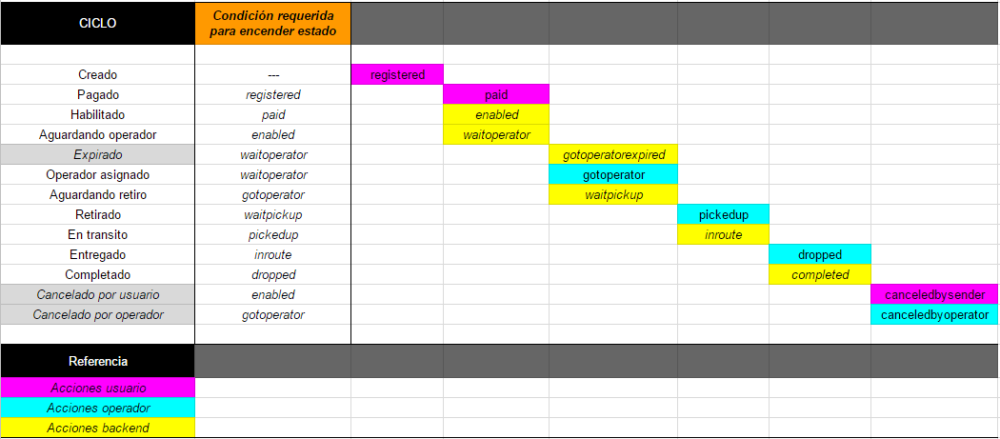

# **LOGIC/DATA FLOW**

> IONIC APP  
> Usuario servicio / Operador      
  
&nbsp;  
&nbsp;  

---
## **# MENU** > SITEMAP

    [Menu]
        SERVICIOS
            _+ (crear nuevo)
                Nuevo servicio (paso 1)
                    _tomar foto
                    _form_crear (descripcion, tipo, valor)
                    _siguiente
                Nuevo servicio (paso 2)
                    _form_retiro (dirección, horario, contacto)
                    _siguiente
                Nuevo servicio (paso 3)
                    _form_entrega (dirección, horario, contacto)
                    _siguiente
                Nuevo servicio (paso 4)
                    visualización info cargada
                    visualización mapa con trayecto dibujado
                    calculo de precio servicio
                    _confirmar
                        crea servicio
                        _ir a pagar
                            redirige a checkout
                        _volver a servicios
                            opcíón para salir sin pagar
                    _cancelar
                        cancela el servicio cargado (aun no creado)
                        y vuelve a lista servicios

        OPERADOR
        
        PAGOS
        
        HISTORIAL
        
        NOTIFICACIONES
        
        AYUDA
        
        AJUSTES
            _tomar foto
                modifica foto perfil
            _popover
                _Nombre y Apellido
                    modificar 
                _Dirección de email
                    modificar
                _Número de móvil     
                    modificar
            Perfiles
                _actualizar
                    actualiza vista estado perfil
            Avisos
                _toggle notificaciones locales  
                    habilita / deshabilita notificaciones locales
                _toggle email
                    habilita / deshabilita notificaciones via email

       

&nbsp;  
&nbsp;  

---
## **# SECCIONES**

&nbsp;  
> ### **SIGN-UP**
> ### **Crear Usuario** > Paso 1
> Form para crear usuario  
> Datos de registro:
>  - email 
>  - contraseña  
> &nbsp;

&nbsp;

*pages/signup/signup.ts*  

    
    submit()  
        form.invalid  
            showError
        form.valid  
            createUser()  
                goTo > createAccountStep1()  
                    redirige a page para completar datos personales
            CF_Trigger 
                (ver Cloud Functions)
                user.onCreate()
                    dispara cloud function: setUserVerifyEmail
                    envia email de validación de correo electronico ingresado
            
FIREBASE

    AUTH
        create user

    DATABASE
        userAccount
            uid
                (user account node)
   
    CLOUD FUNCTIONS
        functions.auth.user().onCreate()
            setUserVerifyEmail()

&nbsp; 

--- 
> ### **SIGN-UP**
> ### **Crear Usuario** > Paso 2
> Este paso es forzado a completarse, si el usuario sale antes de completar, al loguerse nuevamente se redirige a esta pantalla.
> Solo puede salir de esta pantalla completando los datos requeridos.
>   
> Form para datos adicionales del usuario:    
>  - nombre  
>  - apellido  
>  - telefono  
>  - foto perfil (opcional)
>  - ver y aceptar TOS   
> &nbsp;

&nbsp;

*pages/signup-merge/signup-merge.ts*

    uploadPicture()
        getPicture()
            toma foto con camara de movil
        uploadProfileImage()
            guarda foto en storage 
        updateAccountImage()
            actualiza perfil
    submit()
        form.invalid || !TOS_accepted
            showError
        form.valid 

&nbsp; 

---
> ### **AJUSTES**  
> Pagina de ajuste y visualización de datos del usuario.  
> Visualizar:  
>   - nombre y apellido
>   - dirección de email
>   - número de móvil
>   - Perfiles
>       - registro (estado del alta como usuario)  
>       - servicio (estado del alta como solicitante de servicio)
>       - operador (estado del alta como operador)  
> &nbsp;  
>
> Acciones:  
> - foto de perfil
> - nombre y apellido
> - dirección de email  
> - número de movil
> - actualizar vista
>   - boton actualizar
>   - deslizar hacia abajo 
> Avisos
> - notifaciones vía email
> - notificaciones locales  
> &nbsp;

&nbsp;  

*pages/settings/settings.ts*

    doRefresh()
        actualiza datos de la vista
    updateUserProfileStatus()
        actualiza estado de perfiles
    updateNotificationSettings()
        actualiza estado de las notificaciones
    updatePicture()
        modifica imagen perfil
    signOut()
        desloguearse

&nbsp; 

---
> ## **SERVICIOS**
> &nbsp;  

&nbsp; 

> ### **Nuevo Servicio** > Paso 1/4
> Paso 1 de alta de servicio  
> form:  
> - foto (opcional)
> - Descripción corta
> - Tipo de objeto
> - Valor a declarar  
> &nbsp;  

&nbsp;  

*pages/sending-create/sending-create.ts*

    ngOnInit()
        initSending
            inicializa sending

    populateForm()
        si es una re-visita, hay datos en parametro
        se rellena form con datos ya ingresados

    takePicture()
        guarda foto tomada con movil
        guarda foto en formato base64

    cancelSending()
        anular todo y salir a sendings

    resetObjectDeclaredValue()
        observer de toggle para "sin valor"
            para toggle=si
                rango de valores deshabilitado
                rango de valores a zero

    submit()
        form.invalid
            showError
        form.valid
            showPictureAlert()
                si no hay foto cargada, alertar
            processForm()
                saveSending()
                    guarda valores en app (sending), no db
                goToNextStep()
                    redirige a paso 2
                    envia datos guardados en parametro   

&nbsp; 

--- 
> ### **Nuevo Servicio** > Paso 2/4
> Paso 2 de alta de servicio  
> form:  
> - dirección de retiro
> - banda horaria de Retiro
> - contacto para retiro  
>  &nbsp; 

*pages/sending-create/sending-create.ts*

    ngOnInit()
        setUser()
            trae datos de usuario
        initPlaceDetails()
        iniMap()
            inicializa google maps
        initForm()
            inicializa form
        getSendingFromParams()
        populatePage()
            rellena datos de form
    

    submit()
        form.invalid
            showError
        form.valid
            update()
                guarda datos en app
            gotoNextStep()
   
&nbsp;    

---
> ### **Nuevo Servicio** > Paso 3/4
> Paso 3 de alta de servicio  
> form: Datos de la Entrega  
> - dirección de entrega
> - banda horaria de Entrega
> - contacto para entrega  
>   &nbsp;  

*pages/sending-create-3/sending-create-3.ts*

    ngOnInit()
        setUser()
            trae datos de usuario
        initPlaceDetails()
        iniMap()
            inicializa google maps
        initForm()
            inicializa form
        getSendingFromParams()
        populatePage()
            rellena datos de form  

    submit()
        form.invalid
            showError
        form.valid
            update()
                guarda datos en app
            gotoNextStep()

&nbsp; 

---
> ### **Nuevo Servicio** > Paso 4/4 
> Paso 4 de alta de servicio  
> form: Confirmar Datos  
> - visualización completa de servicio cargado
> - visualización de trayecto dibujado en mapa
> - calculo de precio del servicio
> - confirmar crear servicio
> - redirigir a Pagar (Checkout)  
>  &nbsp;

&nbsp;

*pages/sending-create-4/sending-create-4.ts*

    ngOnInit()
        getSendingFromParams()
        initMap()
            inicializa mapa
        initRouteDetails()
        getRoute()
            inicializa mapa
            obtiene datos de trayecto
            dibuja trayecto sugerido en mapa
            setPrice()
                establece precio en función de distancia aproximada

    runCreate()
        create()
            opc:confirmar
                createSending()
                    sendingSrv.register()
                        getSummary()
                        dbSrv.newSending()
                        logNotifications()
                        uploadSendingImage()
                            updateSendingImage()
                        runPayment()
                            alert()
                                opc:pagar
                                    goToCheckout()

&nbsp;  

---
> ### **CHECKOUT**
> 
> ingresar datos de tarjeta de crédito 
> se crea pago con Mercadopago
> - si hubiese un error, se devuelve con mensaje en alerta  
> &nbsp;  

&nbsp;  

*pages/checkout/checkout.ts*

    ngOnInit()
        setUser()
            setea user data
        setCurrentDates()
            setea fechas para usar con pago (vencimiento tarj)
                current
                    fecha actual
                currentplus20
                    hoy+20años
        setDefaultDates()
            setea fecha por defecto para vencimiento tarjeta (mes/año actual)
        setSending()
            setea sending con dato en param
        initForm()
            inicializa form
        setGenericCreditCardImage()
            setea imagen x defecto tarj
   
    guessPaymentMethod()
        valida nro de tarjeta ingresado con API y resuelve emisor
    
    runCheckout()
        isFormValid()
            valida campos completos form 
                (cardNumber, securityCode, cardExpiration, 
                cardHolderName, docNumber, docType, paymentMethodId)
            setTokenData() 
                setear datos para solicitar token
            createCardToken()
                crear card token (MP API)
            validateCardTokenAndPay()
                tokenHasError()
                    true
                        showCardTokenErrors()
                            display errores al generar token (CardToken API)
                            (errores previos al intento de pago)
                    false
                        createPayment()
                                crear pago
                            getPrepaymentData()
                                setear datos para crear pago
                            paySrv.checkoutMP()
                                    hacer pago (envia solicitud a server)
                                clearSessionMP()
                                    // hack por si hay que repetir pago en caso de error
                                getPaymentResultState() 
                                    setea estado del pago en función de respuesta
                                saveResultAndShowAlert()
                                    en función del resultado, muestra mensaje

&nbsp;  
&nbsp;  

---
## **# CLOUD FUNCTIONS**
### Firebase Cloud Functions (CF)

&nbsp;

> Main file  
> *functions/index.js*

    setUserVerifyEmail()   

&nbsp;    

> ### **Trigger: On User Create** 
> **Verificación de dirección de correo del usuario**   
> Envía email de verificación
> - se crea usuario con firebase.auth()
> - CF dispara ejecución de exports.setUserVerifyEmail
>   - crea y escribe token en DB  
>       /userVerifyEmailTokens/  
>       /userVerifyEmailTokensByUser/  
>   - envía email en español a user.email con link de validación   
> &nbsp;

&nbsp;

*functions/services/user-email-validation.js*

    set()
        writeTokenData()
                escribe en db
            sendEmail()
                envia email con link
   

&nbsp;  
&nbsp;  

---
## **# SERVICIO: ETAPAS Y ESTADOS**

**STAGES**  | **STATES** | Detalle
----------- | ---------- | -------
CREATED | &nbsp; | Creado
 &nbsp; | registered | ha sido registrado correctamente. 
 &nbsp; | paid | el pago ha sido intentado, en proceso de confirmarse.  
 &nbsp; | enabled | el pago ha sido confirmado, el servicio queda habilitado para operar en Mooven.
LIVE | &nbsp; | En vivo 
 &nbsp; | waitoperator | el servicio esta disponible para ser tomado por un operador.   
 &nbsp; | gotoperator | el servicio ha sido tomado por un operador.
 &nbsp; | waitpickup | el servicio esta en espera de ser retirado por el operador asignado. 
 &nbsp; | pickedup | el servicio ha sido retirado por el operador.  
 &nbsp; | inroute | el servicio esta en ruta hacia el destino.
 &nbsp; | dropped | el servicio ha sido entregado en destino.
CLOSED | &nbsp; | Cerrado
 &nbsp; | complete | el servicio ha sido completado satisfactoriamente.
 &nbsp; | canceledbysender | el servicio ha sido cancelado por el solicitante.
 &nbsp; | canceledbyoperator | el servicio ha sido cancelado por el operador.
 &nbsp; | gotoperatorexpired | el servicio ha expirado antes de ser tomado por un operador.

&nbsp;  
&nbsp;  

> ### **Display de estado**
> Etapa/estado combinado visualizado mediante icono en pantalla "Servicios".  
> &nbsp;  

**DISPLAY COMBINADO**  | Stage  | Status        | Icono | Texto
---------------------- | ------ | ------------- | ----- | -----
created_registered  | CREATED   | registered    | time  | boton PAGAR
created_paid        | CREATED   | paid          | card | Verificando pago
created_enabled     | CREATED   | enabled       | send | Aguardar Operador
live_waitoperator   | LIVE      | waitoperator  | send | Aguardar Operador
live_gotoperator    | LIVE      | gotoperator   | home | Aguardar Retiro
live_waitpickup     | LIVE      | waitpickup    | home | Aguardar Retiro
live_pickedup       | LIVE      | pickedup      | pin | En transito
live_inroute        | LIVE      | inroute       | pin | En transito
live_dropped        | LIVE      | dropped       | checkmark-circle | Entregado 
closed_completed    | CLOSED    | completed     | checkmark-circle | Entregado
closed_canceledbysender | CLOSED | canceledbysender | alert | --
closed_canceledbyoperator | CLOSED | canceledbyoperator | alert | -- 

&nbsp;  
&nbsp;  

---
## **# SERVICIO: LIFE CYCLE**

&nbsp;  
&nbsp;  

---
## **# DATABASE: TREE**

> userAccount

        userAccount
            {uid} 
                ToS
                    accepted
                    acceptedTimestamp
                    acceptedVersionId
                    acceptedVersionTag
                    history
                        {uid}
                            timestamp
                            versionId
                active
                createdAt
                deletedAt
                profile
                    data
                        dateBirth
                        email
                        emailOnChange
                        firstName
                        lastName
                        legalIdentityNumber
                        phoneMobile
                        phonePrefix
                        photoPath
                        photoURL
                        residenceAddress
                        residenceAddressL2
                        residenceCity
                        residenceCountry
                    status
                        basic
                            fieldsComplete
                            VerificationsComplete
                        operator
                            fieldsComplete
                            VerificationsComplete
                        sender
                            fieldsComplete
                            VerificationsComplete
                    verifications
                        email
                            verified
                            verifiedAddress
                            verifiedTimestamp
                        legalIdentity
                            imageURL
                            verified
                            verifiedBy
                            verifiedNumber
                            verifiedTimestamp
                        phone
                            verified
                            verifiedNumber
                            verifiedTimestamp
                        residenceAddress
                            imageUrl
                            verified
                            verifiedAddress
                            verifiedBy
                            verifiedTimestamp
                providerId
                settings
                    notifications
                        email
                        localPush

&nbsp;
> userVerifyEmailAttemptsByTokens

    userVerifyEmailAttemptsByTokens
        {tokenId}
            timestamp
            token
            validToken
            verified

&nbsp;
> userVerifyEmailResend

    userVerifyEmailResend
        {uid}
            timestamp
            userId

&nbsp;
> userVerifyEmailTokens

    userVerifyEmailTokens
        {tokenId}
            email
            expire
            token
            uid     (userId)
            used

&nbsp;
> userVerifyEmailTokensByUser

    userVerifyEmailTokensByUser
        {userId}
            {tokenId}
                timestamp
                token
                uid     (userId)

TEMPLATE
---

### lorem ipsum 
> lorem ipsum  
> -  lorem ipsum 

*pages/yiytit/yorytort.ts*

    ngOnInit()      
   
---